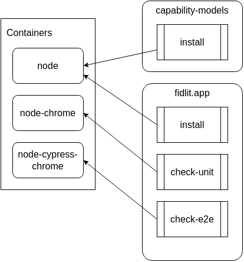

# Contributing

Fidlit&reg; and this entire code base is copyrighted to Eric Swanson.
However, it is shared freely for learning. A future version may offer
open source licensing.

## Project structure

## Resources

- [Ionic Desktop Tips & Tricks](https://ionic.io/blog/tips-tricks-for-ionic-on-desktop) 🔗
- Generate [YouTube thumbnail images](https://www.get-youtube-thumbnail.com/) 🔗
- [MLA Citations](https://owl.purdue.edu/owl/research_and_citation/mla_style/mla_formatting_and_style_guide/mla_works_cited_page_books.html) 🔗
- [O'Reilly Book Search](https://learning.oreilly.com/beta-search/?q=) 🔗 _\*Requires license._
- [Amazon Advanced Book Search](https://www.amazon.com/advanced-search/books) 🔗
- [Lighthouse web performance report](https://github.com/GoogleChrome/lighthouse#readme) 🔗
- [Cypress Angular Schematic](https://www.npmjs.com/package/@cypress/schematic) 🔗

## Troubleshooting

## Windows and macOS

- Podman on Windows and macOS must be run in "rootful" mode with `podman machine set --rootful`.

### Windows with Git BASH

- Git BASH users should set `export MSYS_NO_PATHCONV=1` in their "~/.bashrc" file (create it if it does not exist)
- Git BASH users can avoid the warning "please create a known_hosts file. The next time this host is connected to, podman will add it to known_hosts", with `touch ~/.ssh/known_hosts`
